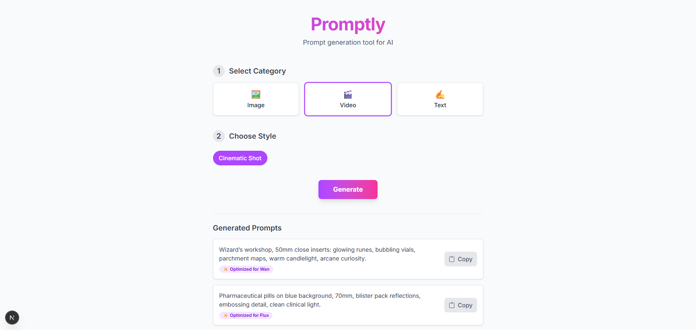

# Promptly

Prompt generation tool for AI.



## Tech Stack
* **Backend:** FastAPI (Python)
* **Frontend:** Next.js (React) & Tailwind CSS

## Prerequisites

* **Python:** Version 3.8 or newer.
* **Node.js:** Version 18.x or newer.
* `pip` for Python package installation.
* `npm` or `yarn` for Node.js package installation.

## Getting Started

### Backend

1.  **Navigate to API directory:**
    ```bash
    cd api
    ```

2.  **Create and activate Python virtual env:**
    ```bash
    # Create the environment
    python -m venv venv

    # Activate on macOS/Linux
    source venv/bin/activate

    # Activate on Windows
    .\venv\Scripts\activate
    ```
    
3.  **Install the required dependencies:**
    ```bash
    pip install -r requirements.txt
    ```

4.  **Run the backend server:**
    ```bash
    uvicorn main:app --reload
    ```
### Frontend

1.  **Navigate to frontend directory:**
    ```bash
    cd promptly-frontend
    ```

2.  **Install the required dependencies:**
    ```bash
    npm install
    ```

3.  **Run the frontend server:**
    ```bash
    npm run dev
    ```

## Support

If you find Promptly useful, please consider supporting the project.

<a href="https://buymeacoffee.com/vpakarinen" target="_blank"></a>
<a href="https://ko-fi.com/vpakarinen" target="_blank"></a>

## Author

- Ville Pakarinen (@vpakarinen2)
